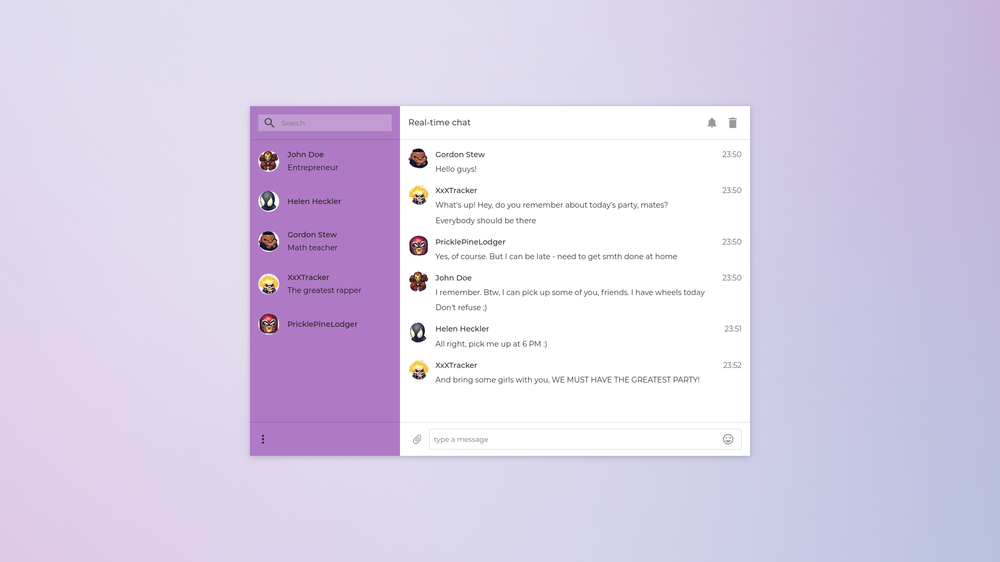

# Real-time chat
A quite simple real-time chat built with WebSockets + React + Express.js

## Used stack
- Node.js (Express.js)
- React.js
- Sass + PostCSS
- WebSocket
- Webpack

## Credits

[Speech bubble free icon](https://www.flaticon.com/free-icon/speech-bubble_1078011#term=chat&page=1&position=10)
(made by Freepik from www.flaticon.com)

[Material Design](https://www.flaticon.com/packs/material-design/)
(made by Google from www.flaticon.com)

Design inspired by [this](https://dribbble.com/shots/2011625-Chat-App) chat-app (didn't find any more reliable sources)
